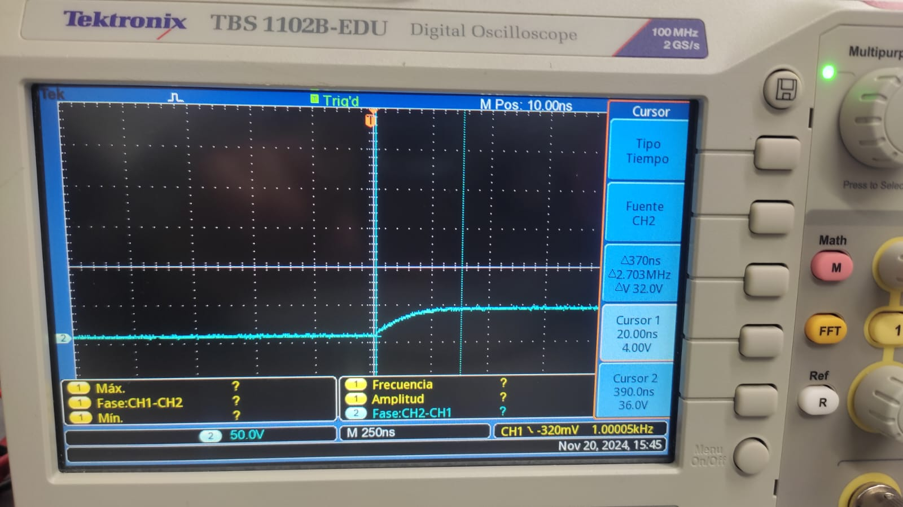
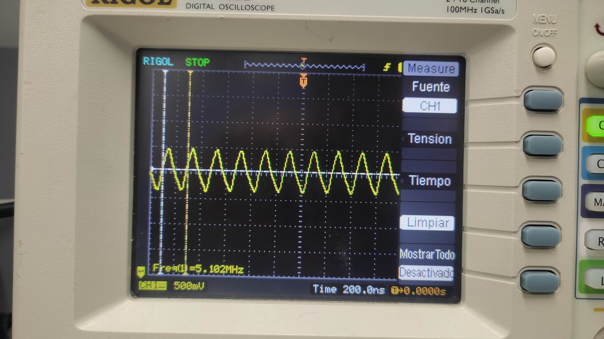
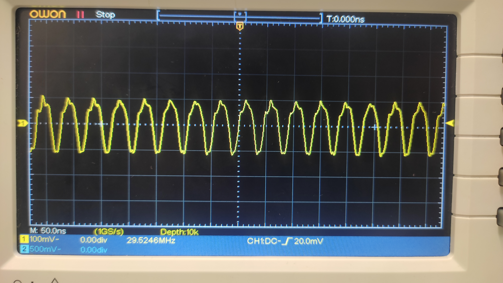

# Digital 1, Lab 1: COMPARACIÓN DE TECNOLOGÍA CMOS y TTL

### Especificaciones técnicas Negador TTL 74LS04
La compuerta negadora 74LS04 pertenece a la familia lógica TTL (Transistor-Transistor Logic) de tipo Low Power Schottky, conocida por su alta velocidad. Este integrado incluye seis compuertas NOT independientes. El voltage de operación dc tiene un rango desde 4.75V hasta los 5.2V. Su voltaje de operación estándar es de 5 V, aunque puede soportar hasta un máximo de 7 V. El tiempo de propagación es rápido, rondando los 10 a 15 nanosegundos, y tiene la capacidad de manejar corrientes de salida de hasta 8 mA en estado bajo y 0.4 mA en estado alto.

A pesar de su velocidad, consume más energía en comparación con tecnologías más modernas como CMOS. Es ideal para aplicaciones donde se requiere compatibilidad con otras familias TTL y operación en rangos de temperatura de -55°C a 125°C.

### Especificaciones técnicas Negador CMOS CD4069

El CD4069 es un integrado de la familia lógica CMOS (Complementary Metal-Oxide-Semiconductor), que también incluye seis compuertas NOT. Su tensión de polarizacipón tiene un rango de -0.5V hasta 20V. Su principal ventaja es su rango de voltaje de operación, que va desde los 3 V hasta los 15 V, lo que lo hace muy versátil. Aunque su tiempo de propagación es más lento, entre 30 y 100 nanosegundos, consume mucha menos energía en comparación con el 74LS04, gracias a su bajo consumo estático.

Este integrado tiene una alta inmunidad al ruido y es capaz de manejar corrientes de salida moderadas que dependen del voltaje de alimentación, alcanzando un máximo de 3.4 mA a 15 V. También opera en temperaturas que van de -55°C a 125°C, lo que lo hace robusto en entornos variados.

## Observación de compuertas TTL y CMOS

En la imagen se puede ver la simulación en qucs usando las compuertas TTL y CMOS mencionadas al inicio. El mismo comportamiento se obtuvo al conectar de la misma manera las compuertas en el laboratorio. Es evidente que las compuertas CMOS tienen una señal de salida (negada) mucho más similar a la entrada respecto al negador TTL, lo cula indica en principio que las CMOS se comportan de mejor manera.

### Tensiones umbral
De la metodología propuesta para medir el $V_{IH}$, $V_{IL}$, $V_{OH}$ y $V_{OL}$, no se obtuvieron resultados satisfactorios, puesto que aparentemente la resistencia de entrada y salida de los dispositivos es demasiado alta, del orden de los $10M\Omega$, y por consiguiente deberíamos tener potenciómetros del mismo rango. Por tanto, identificar aquellas tensiones umbral no fue posible. Se realizó la prueba de comprobación de conmutación dispuesta en el datasheet del CMOS, como se muestra en la siguiente imagen, para lo cual los resultados fueron positivos, es decir el LED se encendía cuando la cumperta estaba en LOW y se apagaba cuando la compuerta estaba en estado HIGH.

### Tiempos de reacción
Respecto al tiempo de subida y los demás tiempos de reacción: 

| **Parámetro**               | **74LS04**          | **CD4069**          |
|-----------------------------|---------------------|---------------------|
| **$t_r$ (Tiempo de subida)** | ~19 ns              | ~79 ns              |
| **$t_f$ (Tiempo de bajada)** | ~18.5 ns              | ~92 ns              |
| **$t_{PLH}$ (Retardo Propagación)** | ~21.2 ns          | ~62 ns              |
| **$t_{PHL}$ (Retardo Propagación)** | ~20 ns          | ~80 ns              |

En comparación con los datos otorgados por los datasheet, los $t_{phl}$ y $t_{plh}$ obtenidos en el laboratorio son bastante más altos, esto puede ser a que no se tenían las condiciones de prueba que se expone en los datasheet. Respecto a los tiempos de subida y bajada, se puede evidenciar que los del integradoo de la familia TTL son menores como debería ser, aunque si se midiése corriente deberíamos notar que los CMOS consumen una menor cantidad.  

## Oscilador basado en compuertas NOT CMOS

Se montaron los osciladores con las compuertas CMOS, como se pedía. El primero tenía 3 compuertas y el segundo 5 compuertas. En esta tipología deben montarse en cantidades impares de compuertas para que la salida sea oscilatoria y no $0$. En la teoría, se tiene que entre más compuertas NOT se pongan en serie, la salida tendrá una frecuencia más alta; esto fue lo que se obtuvo, en la primera imagen siguiente (oscilador de 3 compuertas) se observa que la frecuencia de la salida era de unos $5MHz$, mientras que en la segunda imagen, con un oscilador de 5 compuertas, la salida tenía una frecuencia de unos $29MHz$.   

## Simulacion Oscilador 

!(./5_anill
)

