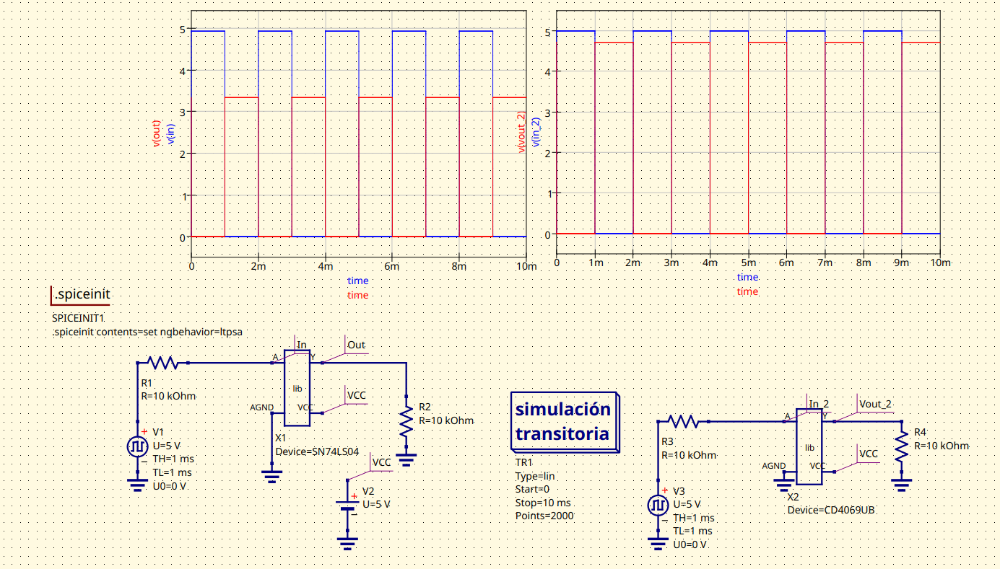
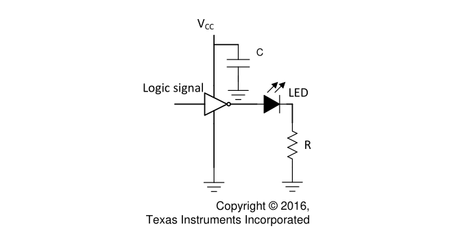

# Digital 1, Lab 1: COMPARACIÓN DE TECNOLOGÍA CMOS y TTL

### Especificaciones técnicas Negador TTL 74LS04
La compuerta negadora 74LS04 pertenece a la familia lógica TTL (Transistor-Transistor Logic) de tipo Low Power Schottky, conocida por su alta velocidad. Este integrado incluye seis compuertas NOT independientes. El voltage de operación dc tiene un rango desde 4.75V hasta los 5.2V. Su voltaje de operación estándar es de 5 V, aunque puede soportar hasta un máximo de 7 V. El tiempo de propagación es rápido, rondando los 10 a 15 nanosegundos, y tiene la capacidad de manejar corrientes de salida de hasta 8 mA en estado bajo y 0.4 mA en estado alto.

A pesar de su velocidad, consume más energía en comparación con tecnologías más modernas como CMOS. Es ideal para aplicaciones donde se requiere compatibilidad con otras familias TTL y operación en rangos de temperatura de -55°C a 125°C.

### Especificaciones técnicas Negador CMOS CD4069

El CD4069 es un integrado de la familia lógica CMOS (Complementary Metal-Oxide-Semiconductor), que también incluye seis compuertas NOT. Su tensión de polarizacipón tiene un rango de -0.5V hasta 20V. Su principal ventaja es su rango de voltaje de operación, que va desde los 3 V hasta los 15 V, lo que lo hace muy versátil. Aunque su tiempo de propagación es más lento, entre 30 y 100 nanosegundos, consume mucha menos energía en comparación con el 74LS04, gracias a su bajo consumo estático.

Este integrado tiene una alta inmunidad al ruido y es capaz de manejar corrientes de salida moderadas que dependen del voltaje de alimentación, alcanzando un máximo de 3.4 mA a 15 V. También opera en temperaturas que van de -55°C a 125°C, lo que lo hace robusto en entornos variados.

## Observación de compuertas TTL y CMOS

En la imagen se puede ver la simulación en qucs usando las compuertas TTL y CMOS mencionadas al inicio. El mismo comportamiento se obtuvo al conectar de la misma manera las compuertas en el laboratorio. Es evidente que las compuertas CMOS tienen una señal de salida (negada) mucho más similar a la entrada respecto al negador TTL, lo cula indica en principio que las CMOS se comportan de mejor manera.

De la metodología propuesta para medir el $V_{IH}$, $V_{IL}$, $V_{OH}$ y $V_{OL}$, no se obtuvieron resultados satisfactorios, puesto que aparentemente la resistencia de entrada y salida de los dispositivos es demasiado alta, del orden de los $10M\Omega$, y por consiguiente deberíamos tener potenciómetros del mismo rango. Por tanto, identificar aquellas tensiones umbral no fue posible. Se realizó la prueba de comprobación de conmutación dispuesta en el datasheet del CMOS, como se muestra en la siguiente imagen, para lo cual los resultados fueron positivos.

